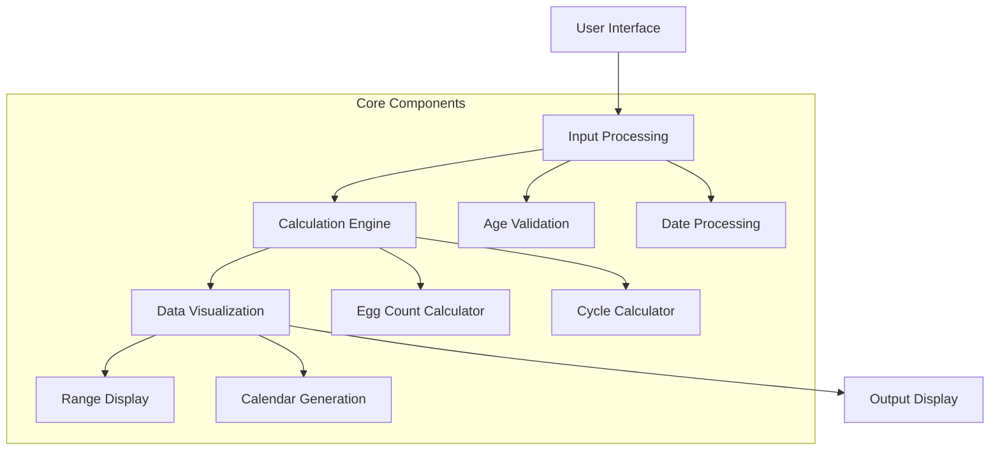
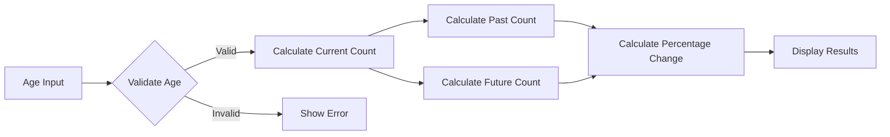
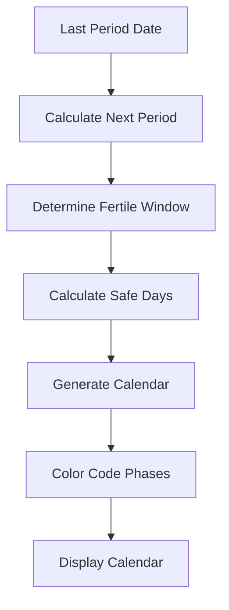
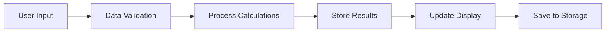
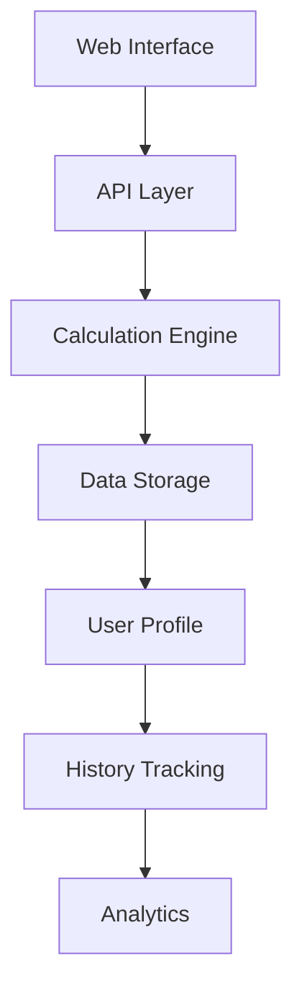
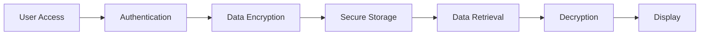
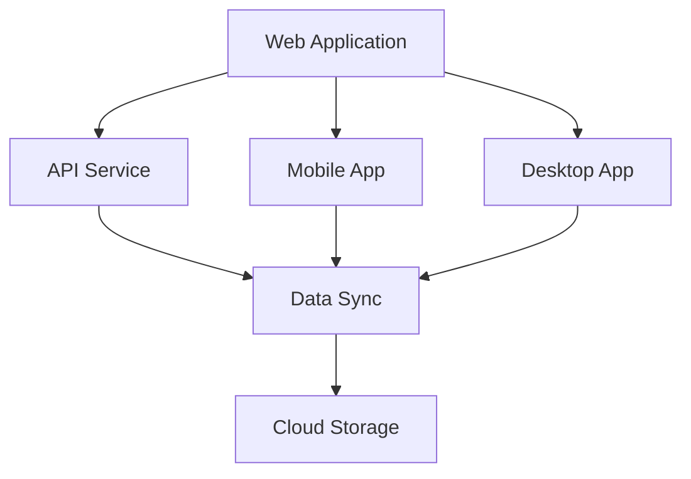
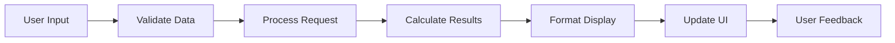

# System Flowcharts

## 1. Main System Architecture

## 2. Egg Count Calculation Flow

## 3. Menstrual Cycle Tracking Flow

## 4. Data Processing Flow

## 5. System Integration Flow

## 6. Security Flow

## 7. Cross-Platform Flow

## 8. User Interaction Flow
